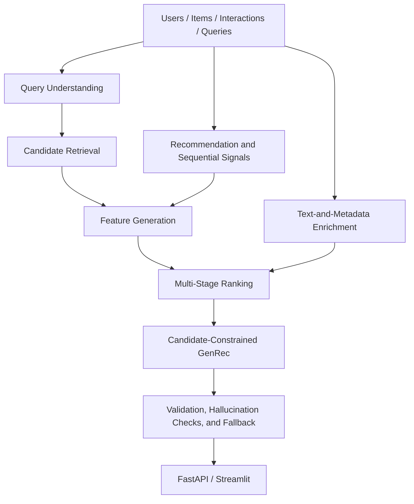

# SearchRec-LLM

An end-to-end search, recommendation, ranking, and candidate-constrained GenRec system for content and commerce discovery.

SearchRec-LLM is a modular, local-first machine-learning project that demonstrates the architecture of a modern search and recommendation stack. It combines hybrid candidate retrieval, collaborative and sequential recommendation, multi-stage ranking, structured query understanding, text-and-metadata item representations, catalog-grounded GenRec, offline validation, and local serving through FastAPI and Streamlit.

The current experiments use synthetic debug data and deterministic mock LLM clients by default. The reported results demonstrate system behavior, reproducibility, model-comparison workflows, and safety constraints rather than production performance; this is not production software.

## Why This System Exists

Search and recommendation systems need more than a single collaborative-filtering model. A practical discovery stack has to understand query intent, retrieve broad candidate sets, combine personalization signals, rank candidates with richer features, handle cold-start items, validate generated outputs, and expose results through service surfaces that can be tested.

SearchRec-LLM implements those concerns as separable local components. Each layer writes artifacts, has focused tests, and is evaluated with task-specific metrics, so the repository can be inspected as a system rather than as a one-off notebook.

## System Architecture



The default workflow is intentionally local: synthetic data, Pandas/NumPy artifacts, PyTorch debug models, optional FAISS-style retrieval with NumPy fallback, LightGBM-compatible ranking with a NumPy fallback backend, and mock LLM clients unless an external provider is configured.

## Design Intuition

- Candidate retrieval before ranking: retrieval reduces a large catalog to a manageable candidate set with high recall and low latency; ranking can then apply richer features to fewer items.
- Baseline-first modeling: BM25, popularity, ItemCF, matrix factorization, and simple rankers provide interpretable reference points before heavier models are compared.
- Sequential user modeling: user intent depends on recent ordered behavior, so GRU4Rec and SASRec model temporal next-item signals beyond static profiles.
- Content for cold start: behavior-only methods struggle with sparse items; text and structured metadata provide item representations before enough interactions exist.
- LLM as controlled augmentation: LLM components parse queries, summarize profiles, rerank candidates, generate constrained recommendations, and produce evidence-grounded explanations without freely searching the catalog.
- Candidate-constrained GenRec: direct generation may invent invalid items; constrained generation restricts output to valid candidate IDs, validates structured responses, and falls back to deterministic ranking when constraints fail.
- Validation-driven selection: each component is evaluated with task-specific metrics instead of selecting models arbitrarily.

## Key Capabilities

| Area | Implemented capabilities |
| --- | --- |
| Data | Synthetic users, items, implicit interactions, temporal split, user sequences, negative samples, query-item pairs |
| Query Processing | Synthetic query generation, rule-based parsing, structured mock-LLM understanding, query rewriting and expansion |
| Candidate Retrieval | BM25, TF-IDF vector retrieval, FAISS-compatible NumPy fallback, hybrid fusion |
| Recommendation | Popularity, ItemCF, matrix factorization, user-history content profiles |
| Sequential Modeling | GRU4Rec and SASRec next-item prediction |
| Ranking | Numeric feature ranker, LightGBM-compatible wrapper, PyTorch MLP, local cross-encoder, mixed reranking |
| Content Representation | Text encoding, structured metadata encoding, fusion, optional image-feature interface |
| GenRec | Direct baseline, candidate-constrained generation, candidate reranking, JSON validation and fallback |
| Safety | Catalog validation, hallucination detection, evidence-grounded explanations |
| Evaluation | Component-specific metrics, final leaderboard, latency-quality reports, error taxonomy |
| Serving | FastAPI endpoints, Streamlit dashboard, Docker configuration |

## Results at a Glance

The table summarizes the selected local baseline for each component. All experiments use the synthetic debug dataset, and metrics measure different tasks, so values are not directly comparable across rows. LLM and GenRec rows use deterministic mock clients by default.

| Component | Selected local baseline | Verified result |
| --- | --- | --- |
| Candidate Retrieval | BM25 | Recall@50 = `1.0000`, MRR@10 = `0.2288` |
| Recommendation | ItemCF | NDCG@10 = `0.0557`, Recall@10 = `0.1200` |
| Sequential Recommendation | SASRec | NDCG@10 = `0.0297`, MRR@10 = `0.0200` |
| Ranking | LightGBM-compatible wrapper (`numpy_linear` backend) | NDCG@10 = `0.2999`, MRR@10 = `0.2274` |
| Structured Query Understanding | Mock LLM query parser | Schema-valid rate = `1.0000`, intent-match rate = `1.0000` |
| Text-and-Metadata Representation | Text + metadata fusion | NDCG@10 = `0.2930`, cold-start Recall@10 = `0.4444` |
| Candidate-Constrained GenRec | Candidate-constrained generation with mock LLM | Valid-item rate = `1.0000`, hallucination rate = `0.0000` |

In the local mock-LLM evaluation, direct generation produced a valid-item rate of `0.9000` and a hallucination rate of `0.1000`, while candidate-constrained generation achieved `1.0000` and `0.0000`, respectively. This motivates the catalog-grounded, candidate-constrained design.

Detailed results:

- [Final Results Summary](docs/final_results_summary.md)
- [Final Leaderboard](validation/results/final_leaderboard.csv)
- [Model Selection Report](validation/reports/final_model_selection_report.md)
- [GenRec Design Decision](validation/reports/final_llm_decision.md)

## Repository Structure

```text
configs/             Experiment and application configuration
src/data/            Data preparation, splitting, negatives, query generation
src/query_understanding/ Rule-based query parsing and encoding
src/retrieval/       Sparse, vector, and hybrid retrieval
src/recommendation/  Classical recommender baselines
src/sequence_models/ GRU4Rec, SASRec, datasets, trainer, evaluator
src/ranking/         Ranking features, datasets, rankers, model IO
src/llm/             Clients, structured parsing, profiles, GenRec, explanations
src/multimodal/      Text/metadata encoders, optional image interface, fusion
src/evaluation/      Metrics, validation, reporting
src/pipelines/       Command-line pipelines
app/api/             FastAPI service
app/dashboard/       Streamlit dashboard
validation/          Experiments, results, reports, ablations, error analysis
tests/               Unit and integration tests
docs/                Technical, reproducibility, evaluation, and demo documentation
```

## Quickstart

Python 3.10 or newer is required.

```bash
git clone https://github.com/ZikunZheng1129/searchrec-llm.git
cd searchrec-llm

python3.10 -m venv .venv
source .venv/bin/activate
python -m pip install --upgrade pip
python -m pip install -r requirements.txt
python -m pip install -e .
```

If `python3.10` is not available, use another Python 3.10+ interpreter.

Run the verification suite:

```bash
python -m pytest tests/
python -m ruff check .
python -m ruff format --check .
bash scripts/check_project_package.sh
```

## Reproduce the Local Workflow

Build the minimal synthetic dataset and query artifacts:

```bash
python3 src/pipelines/build_dataset.py --config configs/data/debug_sample.yaml
python3 src/pipelines/generate_queries.py --config configs/data/query_generation_debug.yaml
```

Regenerate the final validation leaderboard and Markdown reports from existing result CSVs:

```bash
python3 src/pipelines/generate_validation_report.py --config validation/experiments/stage5_debug_validation.yaml
```

For capability-by-capability commands across retrieval, recommendation, sequence models, ranking, LLM query/profile generation, text/metadata representations, GenRec, reports, and package checks, see [docs/reproducibility.md](docs/reproducibility.md).

## Run the API and Dashboard

Launch the API:

```bash
bash scripts/launch_api.sh
```

API docs: `http://127.0.0.1:8000/docs`

Launch the dashboard:

```bash
bash scripts/launch_dashboard.sh
```

Dashboard: `http://localhost:8501`

Both demo surfaces read local artifacts and use mock LLM clients by default. No external API key is required, and models are not retrained per request.

## API Surface

Local OpenAPI docs are available at `http://127.0.0.1:8000/docs` after launching the API.

- `GET /health`
- `GET /artifacts/status`
- `POST /search`
- `GET /recommend/{user_id}`
- `POST /llm/query-understanding`
- `POST /genrec`
- `GET /models/leaderboard`
- `GET /metrics/business`
- `GET /errors/taxonomy`

See [docs/api_reference.md](docs/api_reference.md).

## Documentation

Architecture and Models:

- [Project Overview](docs/project_overview.md)
- [System Design](docs/system_design.md)
- [Model Design](docs/model_design.md)
- [Data Schema](docs/data_schema.md)
- [Technical Reference](docs/technical_reference.md)

Evaluation and Results:

- [Evaluation Plan](docs/evaluation_plan.md)
- [Final Results Summary](docs/final_results_summary.md)
- [Final Report](docs/final_report.md)
- [Limitations and Future Work](docs/limitations_and_future_work.md)

Reproducibility and Demo:

- [Reproducibility Guide](docs/reproducibility.md)
- [Demo Guide](docs/demo_guide.md)
- [API Reference](docs/api_reference.md)
- [Dashboard Guide](docs/dashboard_guide.md)
- [Demo Script](docs/demo_script.md)

## Limitations

- Synthetic debug data only.
- Deterministic mock LLM clients by default.
- No real product images or image embeddings in reported experiments.
- Text-and-metadata fusion is not real visual multimodal learning.
- No real query-user logs; query ranking is primarily relevance/content/business-proxy ranking.
- Local API and dashboard demo only.
- No online A/B testing, production monitoring, or load testing.
- Business metrics are synthetic proxies, not GMV, revenue, CTR, or CVR impact.
- GenRec metrics validate output constraints, parsing, fallback, and hallucination-control mechanics under the mock client; they are not real LLM quality results.

## Future Work

- Real e-commerce data adapter and dataset card.
- Two-tower neural retrieval.
- BERT4Rec or larger sequence models.
- Real LightGBM/LambdaMART ranking experiments.
- Neural text embeddings and true ANN retrieval.
- Precomputed image/CLIP embeddings.
- Real-LLM prompt/provider evaluation.
- Human evaluation for explanations and generated recommendations.
- API load testing, monitoring, and deployment hardening.
