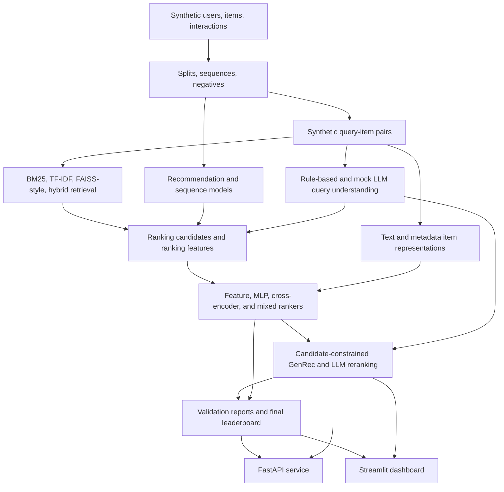

# SearchRec-LLM

A production-style local search and recommendation platform inspired by the common architecture of e-commerce recommendation systems.

SearchRec-LLM is a modular, local-first machine learning system for product discovery. It covers synthetic data generation, structured query understanding, candidate retrieval, recommendation, sequential modeling, multi-stage ranking, text-and-metadata item representations, candidate-constrained generative recommendation, offline validation, FastAPI serving, and a Streamlit dashboard.

The project is designed to demonstrate how a serious search/recommendation stack fits together beyond a single notebook. Traditional retrieval and ranking produce measurable, catalog-grounded candidates; LLM components are used as controlled augmentation for structured parsing, profile summaries, candidate-constrained generation/reranking, and evidence-grounded explanations. It is not production software or production performance evidence.

Current experiments use a small synthetic debug dataset and deterministic mock LLM clients. No external API key is required for the default workflow. The API and dashboard are local demo surfaces, not a production deployment.

## Why This Project

Simple recommendation demos often stop at collaborative filtering over a static ratings matrix. Real discovery systems need more layers: query interpretation, candidate retrieval, personalization, sequential behavior, content representation, ranking, validation, serving, and safe handling of generated outputs.

SearchRec-LLM implements those layers in a reproducible local repository. It is relevant to large-scale recommendation systems, e-commerce search and discovery, content recommendation, product retrieval and ranking, personalized recommendation, sequential user modeling, generative recommendation, and search/recommendation infrastructure. It uses synthetic, publicly shareable examples only and does not depend on proprietary platform data or confidential system details.

## Key Capabilities

| Area | Implemented capabilities |
| --- | --- |
| Data | Synthetic users, items, implicit interactions, temporal splits, user sequences, negative samples, query-item pairs |
| Query understanding | Rule-based parsing plus mock-first structured LLM parsing, query rewriting, and expansion |
| Search retrieval | BM25, local TF-IDF dense retrieval, FAISS-style interface with NumPy fallback, hybrid score fusion |
| Recommendation | Popularity, itemCF, matrix factorization, user-history embedding |
| Sequential modeling | GRU4Rec and SASRec next-item baselines |
| Ranking | Ranking candidate generation, feature ranker, LightGBM-compatible wrapper, PyTorch MLP, tiny local cross-encoder, deterministic mixed ranker |
| Content representation | Text encoder, metadata encoder, optional image-feature interface, text/metadata fusion, cold-start and long-tail slices |
| GenRec | Direct generation baseline, candidate-constrained generation, LLM reranking, output parsing, fallback to ranked candidates |
| Safety and explanations | Item-ID validation, hallucination checks, template explanations, evidence-grounded mock explanations |
| Evaluation | Component-specific result CSVs, final leaderboard, model-selection reports, latency-quality reports |
| Serving | FastAPI endpoints and Streamlit dashboard over local artifacts |

## System Architecture



## Design Principles

- Local-first and reproducible: the default workflow runs on synthetic data with local artifacts.
- Baseline-first: lexical, collaborative, sequence, and ranking baselines are implemented before LLM augmentation.
- Validation-driven: model choices are based on result CSVs and component-specific metrics.
- Retrieval and ranking remain the measurable core; LLMs augment rather than replace them.
- Generated recommendations are candidate-constrained and validated against known item IDs.
- Optional backends have safe fallbacks: NumPy for FAISS-style search, NumPy linear ranking for the LightGBM-compatible wrapper, and mock clients for LLM workflows.
- Limitations are explicit: synthetic data, mock LLMs, no real image signal, local serving, and no production or business-impact claims.

## Repository Structure

```text
configs/             Experiment and application configuration
src/data/            Data preparation, splitting, negatives, query generation
src/query_understanding/ Rule-based query parsing and encoding
src/retrieval/       Sparse, vector, and hybrid retrieval
src/recommendation/  Classical recommender baselines
src/sequence_models/ GRU4Rec, SASRec, datasets, trainer, evaluator
src/ranking/         Ranking features, datasets, rankers, model IO
src/llm/             Clients, structured parsing, profiles, GenRec, explanations
src/multimodal/      Text/metadata encoders, optional image interface, fusion
src/evaluation/      Metrics, validation, reporting
src/pipelines/       Command-line pipelines
app/api/             FastAPI service
app/dashboard/       Streamlit dashboard
validation/          Experiments, results, reports, ablations, error analysis
tests/               Unit and integration tests
docs/                Technical, reproducibility, demo, and career documentation
```

## Quickstart

Python 3.10 or newer is required.

```bash
python3.10 -m venv .venv
source .venv/bin/activate
python -m pip install --upgrade pip
python -m pip install -r requirements.txt
python -m pip install -e .
```

If `python3.10` is not available, use another Python 3.10+ interpreter.

## Run Tests

```bash
python -m pytest tests/
python -m ruff check .
python -m ruff format --check .
```

The Makefile also supports:

```bash
make test
make lint
```

## Reproduce Local Artifacts

Minimal local data and query setup:

```bash
python3 src/pipelines/build_dataset.py --config configs/data/debug_sample.yaml
python3 src/pipelines/generate_queries.py --config configs/data/query_generation_debug.yaml
```

Generate the final validation leaderboard and reports from existing result CSVs:

```bash
python3 src/pipelines/generate_validation_report.py --config validation/experiments/stage5_debug_validation.yaml
```

For capability-by-capability commands across retrieval, recommendation, sequence models, ranking, LLM query/profile generation, text/metadata representations, GenRec, reports, and package checks, see [docs/reproducibility.md](docs/reproducibility.md).

## Run The Demo

Launch the API:

```bash
bash scripts/launch_api.sh
```

Open `http://127.0.0.1:8000/docs`.

Launch the dashboard:

```bash
bash scripts/launch_dashboard.sh
```

Open `http://localhost:8501`.

Both demo surfaces read local artifacts and use the mock LLM path by default.

## Evaluation Snapshot

Current metrics are from the checked-in synthetic debug artifacts. Metrics across different components are not directly comparable.

| Component | Selected local baseline | Key metric |
| --- | --- | --- |
| Retrieval | `bm25` | Recall@50 1.000000; MRR@10 0.228785 |
| Recommendation | `itemcf` | NDCG@10 0.055705; Recall@10 0.120000; Coverage@10 0.980000 |
| Sequential recommendation | `sasrec` | NDCG@10 0.029743; MRR@10 0.020000; Coverage@10 0.670000 |
| Ranking | `lightgbm` wrapper with `numpy_linear` backend | NDCG@10 0.299915; MRR@10 0.227442; Recall@10 0.538462 |
| Structured query understanding | Mock LLM query parser | Schema-valid rate 1.000000; intent-match rate 1.000000; category-match rate 0.923077 |
| Text/metadata representation | `text_metadata_fusion` | NDCG@10 0.292996; Recall@10 0.538462; cold-start Recall@10 0.444444 |
| GenRec safety | `candidate_constrained_generation` with mock client | Valid item rate 1.000000; hallucination rate 0.000000; NDCG@10 0.245409 |

Important caveats:

- Results use a synthetic debug dataset.
- LLM metrics use deterministic mock clients by default.
- The LightGBM-compatible result above used the NumPy linear fallback in the inspected local experiment.
- The FAISS-style retriever used the NumPy backend in the inspected local experiment.
- The current content representation uses text and metadata; no real image embeddings are present.
- Explanation faithfulness is measured by a local rule-based checker, not human evaluation.

More detail:

- [docs/final_results_summary.md](docs/final_results_summary.md)
- [validation/results/final_leaderboard.csv](validation/results/final_leaderboard.csv)
- [validation/reports/final_model_selection_report.md](validation/reports/final_model_selection_report.md)
- [validation/reports/final_llm_decision.md](validation/reports/final_llm_decision.md)

## API Endpoints

Local OpenAPI docs are available at `http://127.0.0.1:8000/docs` after launching the API.

- `GET /health`
- `GET /artifacts/status`
- `POST /search`
- `GET /recommend/{user_id}`
- `POST /llm/query-understanding`
- `POST /genrec`
- `GET /models/leaderboard`
- `GET /metrics/business`
- `GET /errors/taxonomy`

See [docs/api_reference.md](docs/api_reference.md).

## Documentation

Core:

- [Project overview](docs/project_overview.md)
- [System design](docs/system_design.md)
- [Model design](docs/model_design.md)
- [Technical reference](docs/technical_reference.md)
- [Evaluation plan](docs/evaluation_plan.md)
- [Final report](docs/final_report.md)
- [Results summary](docs/final_results_summary.md)
- [Limitations and future work](docs/limitations_and_future_work.md)
- [Reproducibility](docs/reproducibility.md)

Demo:

- [Demo guide](docs/demo_guide.md)
- [API reference](docs/api_reference.md)
- [Dashboard guide](docs/dashboard_guide.md)
- [Demo script](docs/demo_script.md)

Career:

- [Resume bullets](docs/resume_bullets.md)
- [Interview talking points](docs/interview_talking_points.md)
- [Interview Q&A](docs/interview_q_and_a.md)
- [Project pitch](docs/project_pitch.md)
- [Recruiter summary](docs/recruiter_summary.md)
- [LinkedIn project description](docs/linkedin_project_description.md)

## Limitations

- Synthetic debug data only.
- Deterministic mock LLM clients by default.
- No real product images or image embeddings in reported experiments.
- No real query-user logs; query ranking is primarily relevance/content/business-proxy ranking.
- Local API and dashboard demo only.
- No online A/B testing, production monitoring, or load testing.
- Business metrics are synthetic proxies, not GMV, revenue, CTR, or CVR impact.
- GenRec metrics validate output constraints, parsing, fallback, and hallucination-control mechanics under the mock client; they are not real LLM quality results.

## Future Work

- Real e-commerce data adapter and dataset card.
- Two-tower neural retrieval.
- BERT4Rec or larger sequence models.
- Real LightGBM/LambdaMART ranking experiments.
- Neural text embeddings and true ANN retrieval.
- Precomputed image/CLIP embeddings.
- Real-LLM prompt/provider evaluation.
- Human evaluation for explanations and generated recommendations.
- API load testing, monitoring, and deployment hardening.

## Project Status

The repository is complete as a local portfolio and demonstration system. It includes reproducible pipelines, tests, validation reports, a local API, and an interactive dashboard. The current experiments are intentionally small and synthetic.
